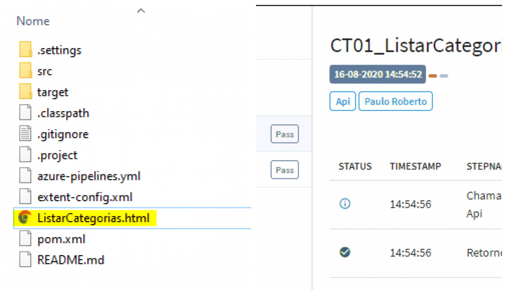

# Testes da Api Chuck Norris com Java, Junit, Rest Assured, Extent Report
Testes automatizados da Api Chuck Norris, utilizando Java, Junit, Rest Assured, Extent Report para gerar um report grafico dos testes.

### Executando o projeto

1. Clone o projeto com o comando [git clone https://github.com/PauloRobert/apichucknorris](https://github.com/PauloRobert/apichucknorris)
2. Importe o projeto no Eclipse
3. Baixe as dependências do mesmo com o Maven
4. Execute o projeto com o Junit

### Testes que podem ser executados

1. Verificar o Status code da operação o ideal é que se seja 200
2. Verificar os itens do Json x o que esta no Banco de dados
3. Fazer um Assert no Json para validar valores

### Report do Projeto

Após a execução o report estara na pasta raiz do projeto, como a imagen abaixo.

